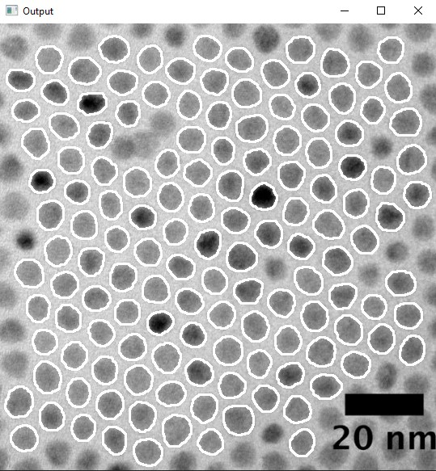

# QD-TEM-Analyzer
The QD-TEM-Analyzer is a program that outputs basic statistics of a given sample of quantum dot (QD) TEM images. In the images directory, you can create a folder for each wavelength and place all the images in the folder. This program will go through all the folders to process the images and save the output into the output folder.

## Installation
* Python 3.10
* `pip install numpy`
* `pip install matplotlib`
* `pip install opencv-python`

## Running the program
* To run the program, run Main.py
* `python3 Main.py`

## Usage
You will be shown the first image to process with each quantum dot highlighted. Select any QDs that you do not want to be included in the final results.

After this, click enter and you will be presented with the next image. Repeat this process for all of the images. Now you are done! Just look at the output folder for the results.
