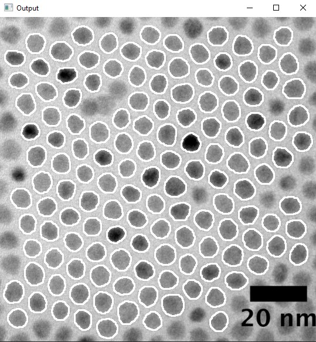

# QD-TEM-Analyzer
A program that outputs basic statistics of a given sample of quantum dot (QD) TEM images. In the images directory, you can create a folder for each wavelength and place all of the images in the folder. This program will go through all of the folders to proccess the images and will save the output into the output folder. 

## Installation
* Python 3.10
* `pip install numpy`
* `pip install matplotlib`
* `pip install opencv-python`

## Running the program
* To run the program, run Main.py
* `python3 Main.py`

## Using the program
You will be shown the first image to process with each quantum dot higlighted. Select any QDs that you do not want to be included in the final results.

